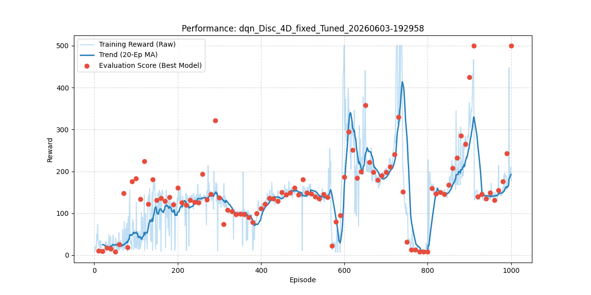
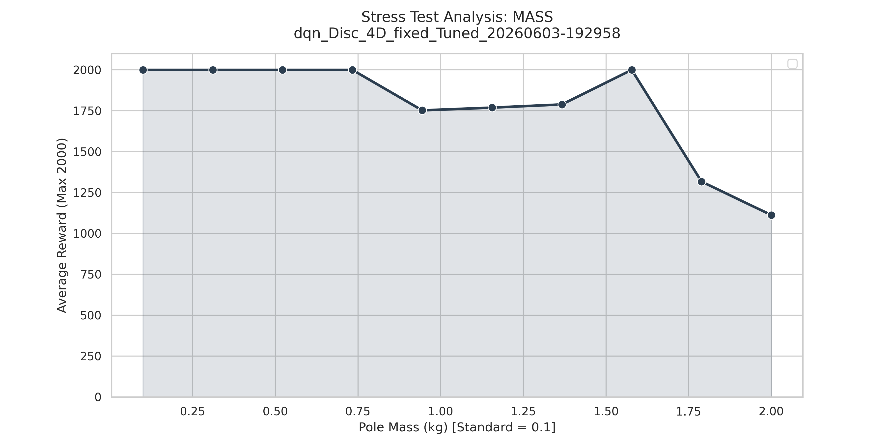
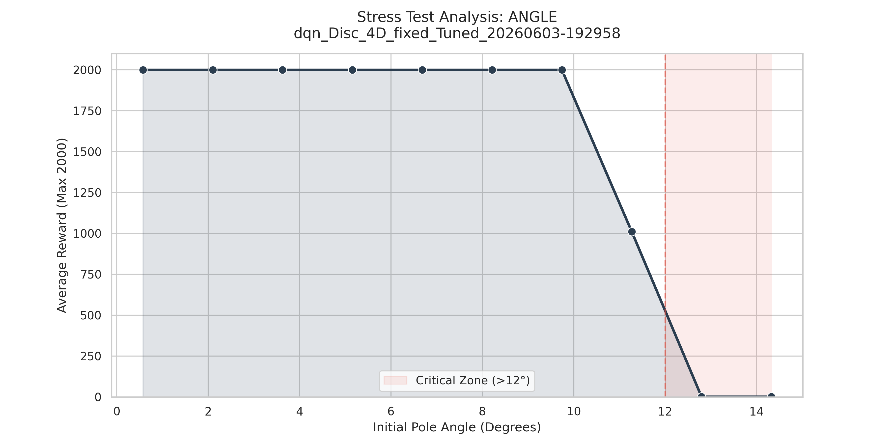

# Constrained CartPole RL Benchmarking Suite


A robust framework for training, tuning, and stress-testing Reinforcement Learning agents on a constrained CartPole-v1 environment. Designed for portability between Google Colab and local environments, with automated data logging, physical robustness analysis, and a bridge to real-world hardware deployment.

---


<p align="center">
  <br />Figure 1: DQN model testing simulation on OpenAI CartPole Environment</i>
</p>


## 🚀 Key Features

*   **Multi-Algorithm Support:** Switch between **Deep Q-Networks (DQN)**, **Q-Learning**, and **SARSA** using a unified interface.
*   **Custom Environment Wrapper (`GymWrapper`):** A custom-built wrapper crucial for managing environment constraints. It dynamically filters states between **2D (Pole Only)** and **4D (Full State Physics)** and handles action space translations—enabling continuous action space mapping specifically tailored for the DQN agent, while the testing being done in full 4D environment.
*   **Overfitting-Aware Checkpointing:** The model is saved at every peak performance point during training, not just at the final episode — ensuring the best generalising model is always retained.
*   **Interactive Training GUI:** Uses `ipywidgets` to select state modes (2D vs 4D), action types, and stopping logic (Fixed episodes vs. Overfitting detection) without touching the code.
*   **Physical Stress Testing:** Evaluates model resilience by simulating hardware/environmental shifts:
    *   **Initial Pole Angle:** Tests recovery from extreme tilt (up to 14°).
    *   **Pole Mass:** Tests how weight variations (0.1kg to 2.0kg) affect balance stability.
*   **Bayesian Hyperparameter Tuning:** Integrated scikit-optimize pipeline for automated parameter search across learning rate, discount factor, and epsilon.
*   **K-Fold Cross Validation:** Applied to Q-Learning to assess policy generalisation, reduce variance, and prevent trajectory-specific overfitting.
*   **Automated Workflow:** Built-in logic for hyperparameter tuning, model saving via `joblib`, and automated GitHub commits directly from Colab.
*   **Visualization:** Automatically renders training videos and generates Seaborn-powered performance graphs for stress analysis.
*   **Hardware Interface Layer:** Arduino Nano GPIO bridge for real-world CartPole deployment with DC motor and incremental rotary encoder.

---

## 🗺️ Project Roadmap

* ✅ **Multi-algorithm core setup** (DQN, Q-Learning, SARSA)
* ✅ **Custom `GymWrapper` integration** for 2D/4D states and continuous datasets
* ✅ **Interactive `ipywidgets` deployment UI dashboard**
* ✅ **Overfitting-aware peak model checkpointing**
* ✅ **Automated physical stress-testing metrics** (Angle/Mass constraints)
* 🔲 **Physical deployment translation validation** across hardware interfaces

## 📁 Repository Structure

```text
├── Code/                         # Core Python application files
│   ├── CartPoleTest.ipynb        # Main notebook to act as an interface for the model
│   ├── cartPoleSetup.ino         # Directions for hardware interface based on Arduino.
│   ├── config.py                 # Centralized hyperparameter and environment configurations
│   ├── control_algorithm.py      # Implementation classes for Q-Learning, SARSA, and DQN agents
│   ├── cross_validation.py       # Cross-validation loop utilities and model training drivers
│   ├── data_logger.py            # Automated tracking for rewards, iterations, and performance logs
│   ├── exploration_strategies.py # Epsilon-Greedy and Softmax strategy modules
│   ├── gym_wrapper.py            # Custom wrapper handling state reduction and continuous actions
│   ├── hardware_interface.py     # Setup infrastructure for physical testbed deployment
│   ├── hyperparameter_tuning.py  # Optimization functions for automated parameter search
├── Results/                      # (Git ignored) Folder for training logs, plots & videos for each iteration
├── requirements.txt              # Full installation dependency manifest
└── README.md                     # Documentation
```

---

## 💻 Setup & Usage
### ⚙️ Prerequisites
All primary environment requirements are isolated within requirements.txt. Core dependencies rely on gymnasium, torch, joblib, and ipywidgets.

### 🌐 Google Colab Workflow

The project is optimized for a Colab-first workflow. The setup cells in the notebook will:
1. Clone the repository.
2. Install system dependencies (`xvfb`, `ffmpeg`) for video rendering.
3. Install Python requirements.

This repository is optimized for an ordered, notebook-first training approach. Open your .ipynb notebook file and execute the cells sequentially through these architectural sections:

Necessary Setup: Automatic environment detection, repository cloning, system virtual display (xvfb/ffmpeg) instantiation, and dependency handling.

Importing Files & Credentials: Handles secure connections to Google Drive and parses encrypted GitHub Tokens (GH_TOKEN) for direct commits.

Functions and Code Import: Loads the foundational modular code blocks from the Code/ directory into the active kernel memory space.

Training the Models: Renders the interactive widget dashboard. Configure your selections and click "Launch Training" to execute optimization cycles.

Testing: Runs validation episodes against the trained agent configurations and renders browser-playable playback videos of peak evaluation runs.

Stress Test: Injects environmental physical stressors to determine edge-case balance failure limitations.

### Local Execution
1. Clone the repo: `git clone https://github.com/SaxenaNamanBase/constrained-cartpole-rl.git`
2. Install dependencies: `pip install -r requirements.txt`
3. Ensure you have a virtual display configured if running on a headless Linux server.

---

## 📊 Evaluation & Analysis

The framework utilizes a multi-tier assessment methodology to validate how effectively models stabilize the system under shifting constraints.

1. **Standard Training & Testing Validation**
Performance metrics capture standard reward accretion plots across epochs. Evaluation routines automatically save performance logs locally to testing_performance_logs.csv and export video tracking arrays to identify behavioral optimizations.

<p align="center">
  <br />
  <i>Figure 2: Reward convergence curve for DQN 500 episodes.</i>
</p>

The apparent drop at the end of training reflects the noisy nature of RL in generalised environments and varying start positions — not model degradation. The best-checkpoint model is what gets deployed.

2. **Model Comparison Replays**
Below is a visual breakdown comparing how two different agent configurations handle the balancing task during testing:

The comparison shows clearly that when the the model is being trained using 4 parameters it performs for a complete cycle without failing, but seems to be more unstable when compared to the 2D model. As while training the 2D model, the parameters namely: Cart Speed and Cart Length are excluded while training, which makes the balancing of the pole very stable, but it fails after some time when the setup goes out of bounds.

<table border="0">
  <tr>
    <td align="center">
      
    </td>
    <td align="center">
      
    </td>
  </tr>
  <tr>
    <td align="center"><b>🤖 Run A: 4D State Mode</b></td>
    <td align="center"><b>🚀 Run B: 2D State Mode</b></td>
  </tr>
  <tr>
    <td colspan="2" align="center">
      <br />
      <i>Figure 3: Side-by-side simulation comparison tracking agent structural stability between variations of the custom GymWrapper.</i>
    </td>
  </tr>
</table>

3. **Physical Stress Testing**
The stress suite aggressively updates internal physics arrays to map out model stability envelopes and determine the Critical Zone (the specific boundary point where stability degrades).

Angle Distribution: Discovers the system's "Basin of Attraction" boundaries when managing intense starting tilt degrees.

<p align="center">
  <br />
  <i>Figure 4: Stress Test for Angle variant for DQN model with 4D parameters</i>
</p>

Mass Variations: Gauges mathematical model durability against changing momentum vectors and structural weight discrepancies.

<p align="center">
  <br />
  <i>Figure 5: Stress Test for Mass variant for DQN model with 4D parameters</i>
</p>

---

## 🧪 Requirements

*   `gymnasium`
*   `torch`
*   `joblib`
*   `matplotlib` & `seaborn`
*   `ipywidgets`
*   `pyvirtualdisplay`

---

## 🔧 Hardware Interface ## 
The cartPoleSetup.ino file provides the Arduino Nano GPIO sketch. It:

*  Reads CLK and DT digital signals from the incremental rotary encoder to compute pole angle and angular velocity.
*  Sends encoder values to the PC via serial (USB Mini-B).
*  Receives motor commands from the PC ('f' = forward, 'b' = backward, 's' = stop) and drives the DC motor via the L298N motor driver.

## 📝 Author's Note
This project was developed as part of an MSc in Artificial Intelligence at the University of Surrey, and subsequently extended into a public benchmarking suite. The primary finding is that DQN with ADAM optimisation significantly outperforms Q-Learning and SARSA on CartPole, and that state space reduction via the 2D GymWrapper mode produces a qualitatively different (more stable but spatially unaware) policy. Use the 4D mode for deployment-intended models.

For best simulation results: use DQN + 4D state mode.
